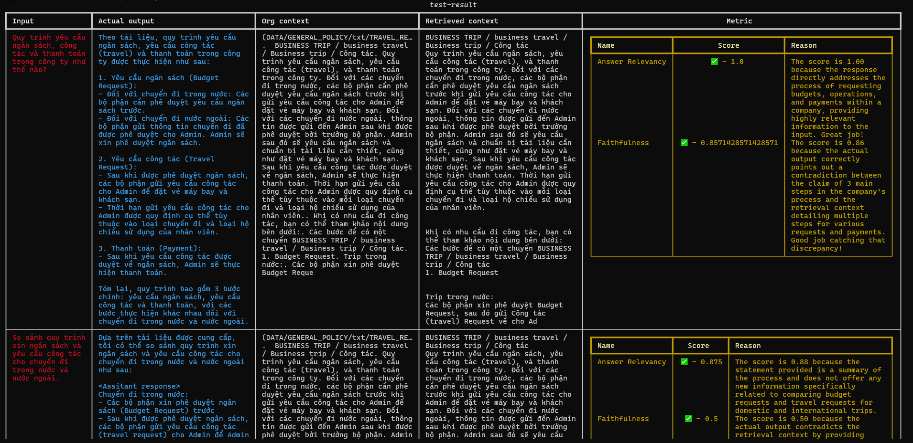
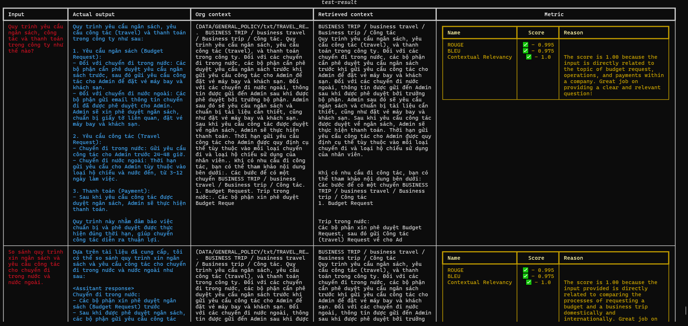
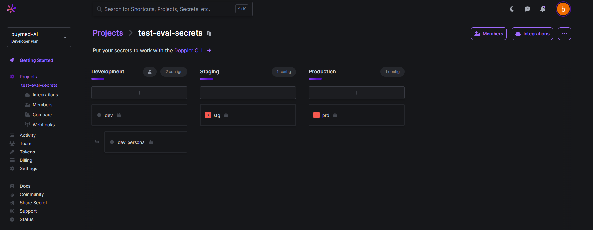
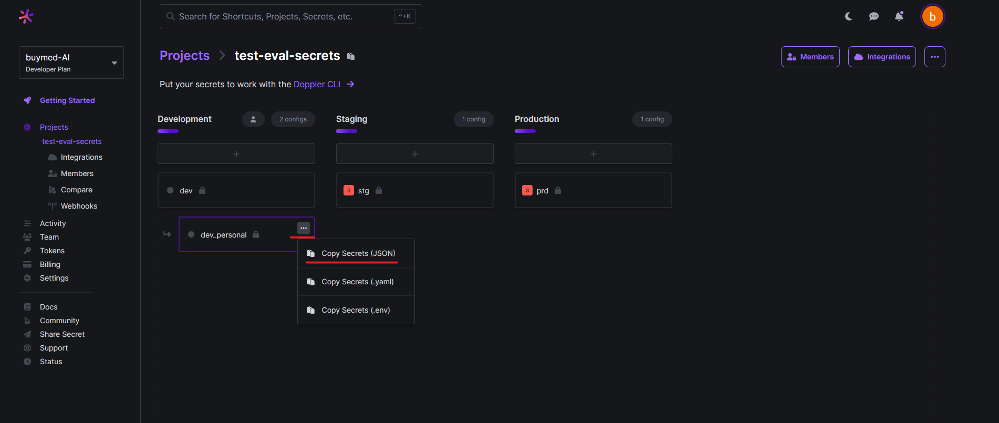

# LLM Evaluator

The LLM Evaluator is a command-line interface (CLI) tool that allows you to create test sets and evaluate your model and RAG pipeline. It supports the generation of Question-Answering datasets for dataset generation.

## Installation
1. Clone the project, change dir to the project folder and run: 
   ```
   pip install . 
   ```
2. To view the help menu, run: 
   
   ```
   llm-eval [command] --help 
   ```
   
3. To get the secret file, please follow the section [Getting your secrets](#getting-your-secrets)
4. To init the CLI, run `llm-eval init [path-to-your-secret-file]`. Eg: 
   
   ```
   llm-eval init llm-evaluation/.vscode/launch.json
   ```

5. You can adjust the settings from the files in `llm_evaluator/configs`. 

##  Dataset Synthesis

This module helps generating the dataset from the uploaded documents in the database or by your local documents. 
### Some notation
- Golden: a test case in the dataset but without actual output from the chatbot. 
- Evolution: a method to generate a more complex and diverse set of questions by providing logics, reasonings, comparison, hypothesis, etc., to the generation bot iteratively. Example: 
    - Example question: `What happens to water as it boils?`
    - Example rewritten question: `How does the boiling point of water at sea level compare to that of alcohol, and how does altitude affect water's boiling point?`
- Breadth evolution: When enabled, the generator uses LLM to generate a more diverse version of the input without necessarily providing extra forms of knowledge. Example: 
    - Example question: `What is the role of bees in ecosystems?`
    - Example rewritten question: `Considering the pivotal role bees play in pollinating both agricultural crops and wild plants, thereby contributing to the diversity of plant life and supporting the foundation of food chains, analyze how bees influence the growth and sustainability of various ecosystems.`
### Usage

- Run command: 

    ```
        llm-eval synthesize qa --config [path-to-the-config-directory] --dataset-save-dir <directory-to-save-location> --data-source <context|document_paths|folder_dir>
    ```
    in which
    - `context`: Enables generation from database chunks of uploaded documents, temporarily processing one document per run.
    - `document_paths`: Enables reading a list of paths to local documents.
    - `folder_dir`: Enables reading all documents in the given folder directory to generate the dataset.
  
    Example: 
    ```
        llm-eval synthesize qa --dataset-save-dir ./dataset --data-source context
    ```
  
- Configs: template provided in `llm_evaluator/configs/synthesize.json`
    ```
        {
            "context": {
                "db_name": name to the chat database 
                "collection_name": name to the uploaded document collection,
                "doc_idx": index of approved document
                "generator": {
                    "max_goldens_per_context": max number of goldens generated per context
                    "num_evolutions": number of iteration of evolutions
                    "enable_breadth_evolve": <boolean>
                }
            },
            "docs": {
                "document_paths": list to the document paths
                "document_folder_dir": directory to the folder , 
                "generator": {
                    "max_goldens_per_document": <explained>
                    "chunk_size": the number of charaters to extract context,
                    "chunk_overlap": overlap size between consecutive text chunks during context extraction,
                    "num_evolutions": <explained>,
                    "enable_breadth_evolve": <boolean>
                }
            }
        }
    ```
### Output format
Example of a golden. Some datasets are generated in the `dataset/qa` folder

```
    {
        "input": "So sánh hướng dẫn đặt phòng họp ở Văn phòng HCM và Văn phòng HN.",
        "actual_output": null,
        "expected_output": null,
        "context": [
            "(DATA/GENERAL_POLICY/txt/meeting_room.txt) ",
            " Hướng dẫn book phòng họp (Meeting Room)",
            "* Văn phòng HCM:",
            "\t+ Tạo cuộc họp mới trên Outlook Calendar và điền vào \"Subject, To & Time\"",
            "\t+ Click vào chỗ trống bên cạnh \"Location\" và chọn phòng còn trống",
            "\t+ Click “Sent” để gửi yêu cầu đặt phòng",
            "* Văn Phòng HN:",
            "\t+ Gửi email đến hung.pham@buymed.com, trước ít nhất 1 giờ",
            "Lưu ý: Mỗi lần book tối đa 2 giờ. Đối với HCM, nếu muốn book trên 2h thì liên lạc",
            "bac.dao@buymed.com"
        ]
    }
```         
## Evaluation

The metrics used in these section will be discussed in other documents

### Model/General pipeline
- Evaluate the answer using metrics that compare model's answer (`actual_output`) and given context (`context`)
- Run command: 
    ```
        llm-eval evaluate eval-model --config-file [path-to-config-file] --dataset <dataset-path> --judge-model <name-of-gpt-judge-model>
    ```
    Example: 
    ```
        llm-eval evaluate eval-model --dataset ./dataset/qa/1334354c-d904-4f03-b0d1-52966505832a.json
    ```

- Default config available at `llm_evaluator/configs/model_eval.json`
  
```
    {
        "db_name": name to the corresponding database,
        "collection_name": collection of the chat ticket,
        "model_api": api of the evaluated model, 
        "metrics": {
            "hallucination": true if enable, false if disable,
            "answer_relevancy": true if enable, false if disable,
            "faithfullness": true if enable, false if disable,
            "bias": true if enable, false if disable,
            "toxicity": true if enable, false if disable
        },
        "metric_params": {
            "threshold": threshold to consider a pass case, default:0.5,
            "include_reason": enable/disable returning reason, default: true
            "async_mode": enable/disable running evaluation in async mode, default: true
        }
    }
```

### RAG
- Evaluate the quality of the retriever using metrics that measure scores between `retrieval_context` and others. 

- Run command: 
    ```
        llm-eval evaluate eval-rag --config-file [path-to-config-file] --dataset <dataset-path> --judge-model <name-of-gpt-judge-model>
    ```
    Example: 
    ```
        llm-eval evaluate eval-rag --dataset ./dataset/qa/1334354c-d904-4f03-b0d1-52966505832a.json
    ```
- Default config available at `llm_evaluator/configs/rag_eval.json` 
    ```
        {
            "db_name": name to the corresponding database,
            "collection_name": collection of the chat ticket,
            "model_api": api of the evaluated model, 
            "metrics": {
                "context_rouge": true if enable, false if disable,
                "context_bleu": true if enable, false if disable, 
                "contextual_precision": true if enable, false if disable, 
                "contextual_recall": true if enable, false if disable, 
                "contextual_relevancy": true if enable, false if disable
            },
            "metric_params":{
                "threshold": threshold to consider a pass case, default:0.5,
                "include_reason": enable/disable returning reason, default: true
                "async_mode": enable/disable running evaluation in async mode, default: true
            }

        }
    ```


## Other docs
### Getting your secrets
1. Use the provided email and password to log in to Google Account
2. Log in to [Doppler](https://dashboard.doppler.com/) by "Log in with Google" auth
3. Go to `projects -> test-eval-secrets`, your dashboard should look like this



4. Copy the json secrets as in image and paste to your `launch.json` file



5. Modify the file following this template: 
```
    {
        "env": {
            "service": <SERVICE>
            "database": <DATABASE>
            "env": "stg"
        }
    }
```

Working on a more elegant method to effortlessly control and share secrets...


## TODO: 
- [ ] Create API
- [ ] Create multiple datasets at once
- [ ] Evaluate on multiple datasets at once
- [ ] Update metrics info
- [ ] Add UI for configs settings
- [ ] Add dataset viewer and modification platform
- [ ] Evaluation results registry